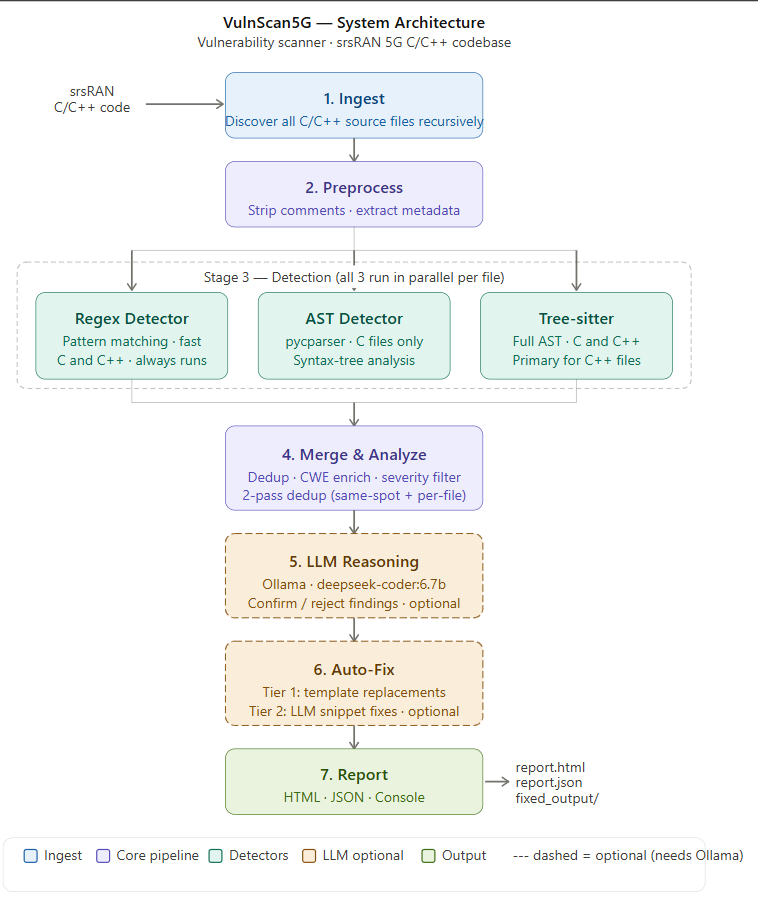
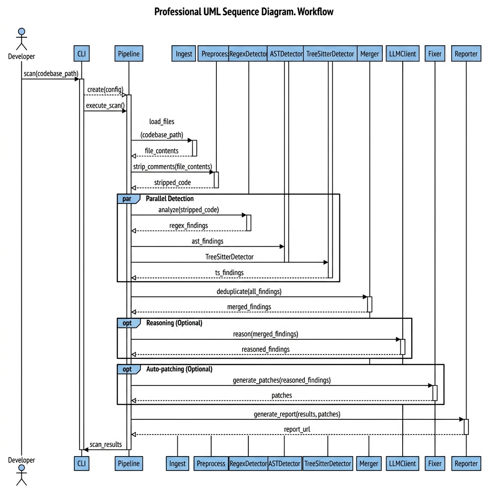
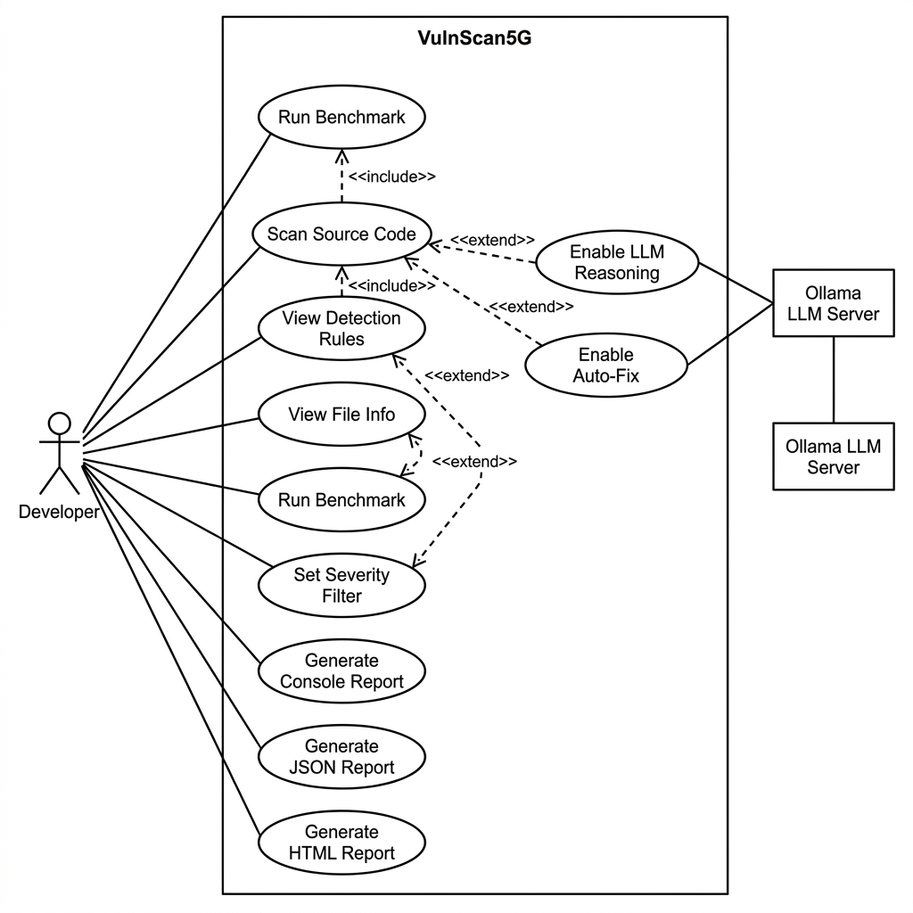
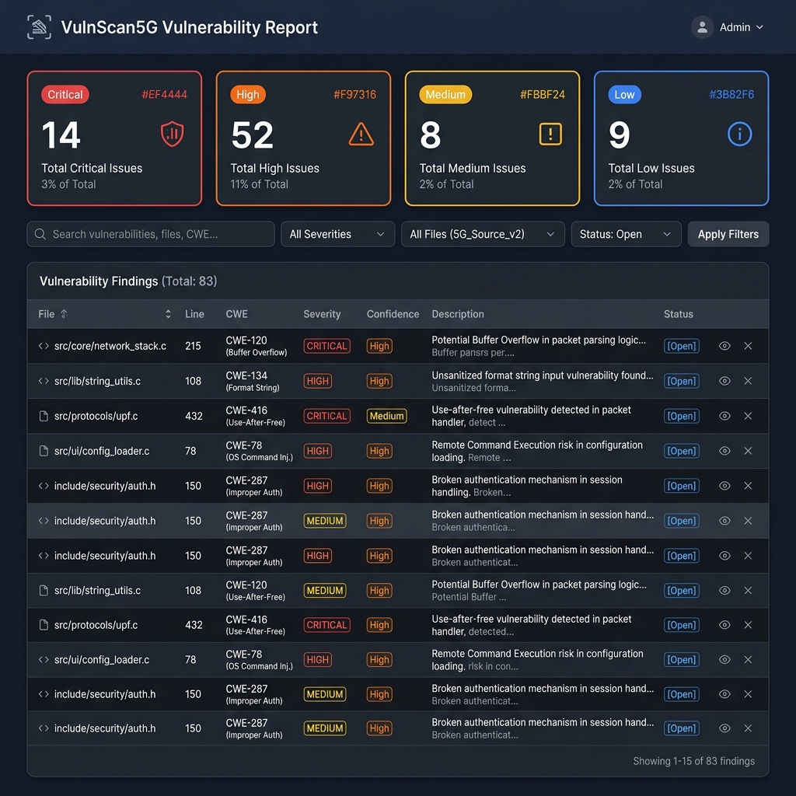

<div align="center">
<h1>🛡️ VulnScan5G</h1>
<p><strong>A robust, CLI vulnerability detector and auto-fixer for C/C++ source files.</strong></p>
<p>
  <a href="https://www.python.org/downloads/release/python-3100/"></a>
  <a href="https://opensource.org/licenses/MIT"></a>
</p>
</div>

---

<h2 align="center">📖 About the Project</h2>

**VulnScan5G** is a Python-based vulnerability scanner and auto-patching tool tailored specifically for C and C++ source code. Built for analyzing security-critical code used in 5G network stacks, embedded systems, and any C/C++ project, it provides high accuracy and safety.

It utilizes a **hybrid detection engine** combining:
- **AST (Abstract Syntax Tree) parsing** (via `pycparser`)
- **Tree-sitter semantic analysis**
- **Regular Expressions**

What sets VulnScan5G apart is its robust **auto-patching pipeline**, leveraging a local Large Language Model (LLM) via [Ollama](https://ollama.ai/) for reasoning and fallback generation, supplemented by a deterministic template-based auto-fixer for known vulnerabilities.

---

<p align="center">
  
</p>

<h2 align="center">Key Features</h2>

- 🔍 **High Accuracy Hybrid Scanning**: Combines AST for semantic depth and Regex for speed to minimize both false positives and negatives.
- 🛠️ **Safe Auto-Patching**: Two-tier fixer guarantees unchanged code is never corrupted. Uses fast templates for known flaws and LLM reasoning for complex bugs.
- 🔒 **Privacy-Preserving Local LLM**: Code never leaves your machine. Ollama integration runs completely locally.
- 🚀 **Blazing Fast**: Template fixers patch common bugs instantly. AST/Tree-Sitter/Regex detectors scan thousands of files in seconds.
- 📊 **Rich Reporting**: Outputs comprehensive CLI tables, detailed JSON reports, and beautiful HTML dashboards.

---

<h2 align="center">Architecture & Pipeline Workflow</h2>

The VulnScan5G pipeline is designed to be sequential, deterministic, and highly accurate:

<p align="center">
  
</p>

1. **Ingestion & Preprocessing**: Recursively discovers `.c`, `.cpp`, `.h`, `.hpp` files, strips comments, and normalizes whitespace while maintaining accurate line numbers.
2. **Hybrid Detection**:
   - *AST Detector (`pycparser`)*: Primary engine for C code. Understands scope and variable types.
   - *Tree-sitter Detector*: Primary engine for C++ code, fault-tolerant parser.
   - *Regex Detector*: Fast baseline for catching string-matching patterns.
3. **Deduplication & Merging**: Merges findings on the same line, assigns CWEs, and deduplicates to prevent report spam.
4. **LLM Reasoning (Optional)**: Acts as an expert judge, filtering out false positives by analyzing code snippets.
5. **Auto-Fix Generation**:
   - *Tier 1 (Templates)*: Deterministic regex patches for known unsafe patterns (e.g., `gets` → `fgets`).
   - *Tier 2 (Snippet LLM)*: Generates contextual fixes using local LLMs for complex bugs.
6. **Reporting**: Generates a terminal table summary, static HTML dashboard, or JSON outputs.

<p align="center">
  
</p>

---

<h2 align="center">🛠️ Requirements & Installation</h2>

<h3 align="center">System Requirements</h3>
- **OS:**  Windows, Linux, or macOS.
- **Python:**  Python 3.10 or higher.
- **Dependencies:**  C compiler (`gcc`/`clang`) for compilability testing.
- **Hardware:**  Sufficient RAM and an optional GPU to run local LLMs (e.g., DeepSeek-Coder 6.7B) via Ollama.

<h3 align="center">Installation</h3>

1. **Clone the repository:**
   ```bash
   git clone https://github.com/your-username/vulnscan5g.git
   cd vulnscan5g
   ```

2. **Install Python dependencies:**
   ```bash
   pip install -e .
   ```
   *(Installs: `click`, `rich`, `pycparser`, `requests`, `jinja2`, `tree-sitter`, `tree-sitter-c`, `tree-sitter-cpp`)*

---

<h2 align="center">Usage & CLI Commands</h2>

VulnScan5G provides a rich command-line interface.

| Command | Description |
|---------|-------------|
| `vulnscan5g scan <path>` | Scan files/directories for vulnerabilities. |
| `vulnscan5g rules` | List all available vulnerability detection rules. |

<h3 align="center">Common Use Cases</h3>

```bash
# 1. Standard Scan (Hybrid: AST + Tree-sitter + Regex)
python -m vulnscan5g scan ./my_project/ -v

# 2. Filter by Severity
python -m vulnscan5g scan ./my_project/ --severity high

# 3. Export Reports (Console, JSON, HTML)
python -m vulnscan5g scan ./my_project/ --report html -o report.html

# 4. Scan + Auto-Fix (Tier 1 Templates)
python -m vulnscan5g scan ./my_project/ --fix

# 5. Scan + LLM Reasoning (Verify True/False Positives)
python -m vulnscan5g scan ./my_project/ --llm

# 6. Full Pipeline: Scan + LLM Verify + Auto-Fix (Tier 1 & 2)
python -m vulnscan5g scan ./my_project/ --fix --llm
```

<h3 align="center">HTML Dashboard Preview</h3>
<p align="center">
  
</p>

---

<h2 align="center">LLM Integration (Ollama)</h2>

VulnScan5G integrates seamlessly with local LLMs via Ollama to provide advanced reasoning and auto-patching capabilities.

1. Install [Ollama](https://ollama.ai/).
2. Pull your preferred model (e.g., `codellama:7b` or `deepseek-coder`):
   ```bash
   ollama pull codellama:7b
   ollama serve
   ```
3. Run VulnScan5G with the `--llm` and `--fix` flags to harness AI power.

---

<h2 align="center">Detection Coverage</h2>

VulnScan5G includes 25 distinct rules covering a wide range of CWEs. Some key categories include:

| Category | CWE | Examples |
|----------|-----|---------|
| **Buffer Overflow** | CWE-120/242 | `gets()`, `strcpy()`, `sprintf()`, `scanf %s` |
| **Format String** | CWE-134 | `printf(var)`, `fprintf(f, var)` |
| **Command Injection** | CWE-78 | `system()`, `popen()` |
| **Use-After-Free** | CWE-416/415 | `free()` without NULL, double free |
| **Integer Overflow** | CWE-190 | `malloc(a * b)`, `realloc(p, n + m)` |
| **Race Condition** | CWE-367 | `access()` then `open()`, TOCTOU |
| **NULL Deref** | CWE-476 | Unchecked `malloc()`, `realloc()` |
| **Memory Leak** | CWE-401 | `malloc` in loop without `free` |

---

<h2 align="center">Credits & License</h2>

- **Datasets:** Uses Juliet Test Suite (C/C++) from the NSA Center for Assured Software.
- **License:** Distributed under the MIT License. See `LICENSE` for more information.

<p align="center">
  <em>Built with ❤️ to secure the next generation of embedded and 5G software.</em>
</p>
